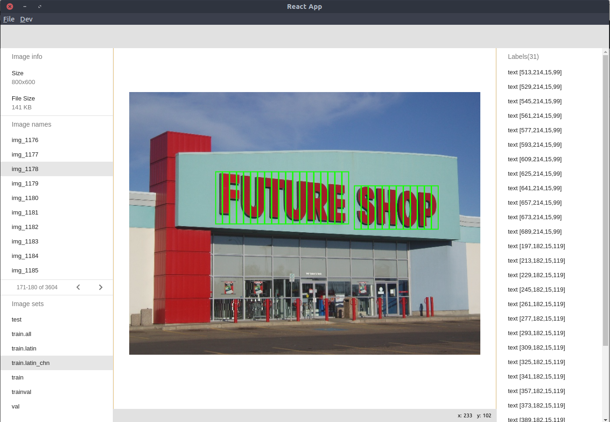

I develop this project to clean up the training dataset for [tf_ctpn](https://github.com/Sanster/tf_ctpn)

Features list:

- [x] Delete Voc object in a annotation
- [ ] More...



Start react development service:

```
npm run start
```

Start electron:

```
npm run dev
```
